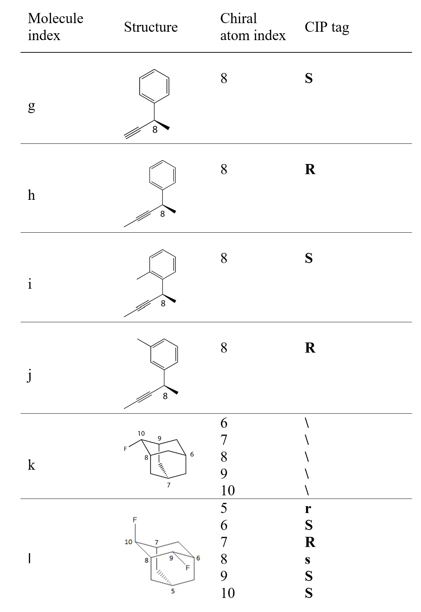

The files in this folder are original structure files for the examples to test the algorithm. The structures are given either in .sdf/.mol format (CTAB V2000) or in .pdb format.
  
Structures under folders a-e are examples used for testing the function of calculating minimal RMSD (by running `CanonizedRMSD.py`). In each folder there are two conformations (numbered 1 and 2) for the molecules and each conformation is provided in both .sdf format and .pdb format.

Molecular information:

|Molecule index|Formula|Number of atoms|Minimal RMSD(Å)|
|-------------|--------|-----------------|----------------|
|a|$\mathrm{C_2H_6O}$|9|0|
|b|$\mathrm{C_7H_{14}}$|21|0|
|c|$\mathrm{C_{20}H_{30}}$|50|0.0857|
|d|$\mathrm{C_{78}H_{102}O_{18}N_{19}}$|217|1.6068|
|e|$\mathrm{C_{192}H_{295}S_2O_{52}N_{49}}$|590|1.6763|

  
Structures named g-l are examples used for testing the function of generating stereochemistry tags of molecules according to CIP rules. The molecules have already been canonized.

CIP stereochemical information:
